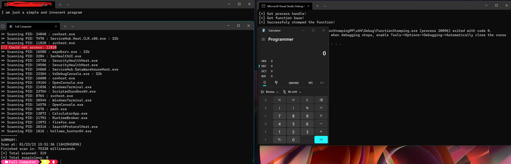

# FunctionStomping
  <br />

## Description
This is a brand-new technique for shellcode injection to evade AVs and EDRs. This technique is inspired by Module Stomping and has some similarities. As to this date (23-01-2022) also <a href="https://github.com/hasherezade/hollows_hunter">hollows-hunter</a> doesn't find it.<br /><br />
The big advantage of this technique is that it isn't overwritting an entire module or pe, just one function and the target process can still use any other function from the target module.<br /><br />
The disadvantage is that it won't work for every function in the wild (but it will work for most of them), the exact explanation is in my blog: <a href="https://idov31.github.io/2022-01-28-function-stomping/">The Good, The Bad And The Stomped Function</a>.

## Usage
You either include the header to your program like this:
```cpp
#include "functionstomping.hpp"

int main() {
    // Just get the pid in any way and pass it to the function.
    DWORD pid = 3110;
    FunctionStomping(pid);
    return 0;
}
```

Or use the rust program (COMING SOON):
```bash
cd functionstomping
cargo b
functionstomping.exe <pid>
```

## Setup
Currently, the shellcode to run is just to pop a calculator, but all you need to do is replace the ```unsigned char shellcode[]``` with your shellcode. I used C++ 17 and VS2019 to compile the program with the C++ header and rust version 2021 to compile the rust program (you can see the dependencies in the Cargo.toml).

## POC



## Disclaimer
I'm not responsible in any way for any kind of damage that is done to your computer / program as cause of this project. This project is currently at alpha and I'm working to make it more stable, please take that in mind!<br /> If you found someone that published about this method before today (23-01-2022) please let me know so I can add an acknowledgment.

## Acknowledgments
https://github.com/countercept/ModuleStomping<br />
https://www.cyberark.com/resources/threat-research-blog/masking-malicious-memory-artifacts-part-iii-bypassing-defensive-scanners
